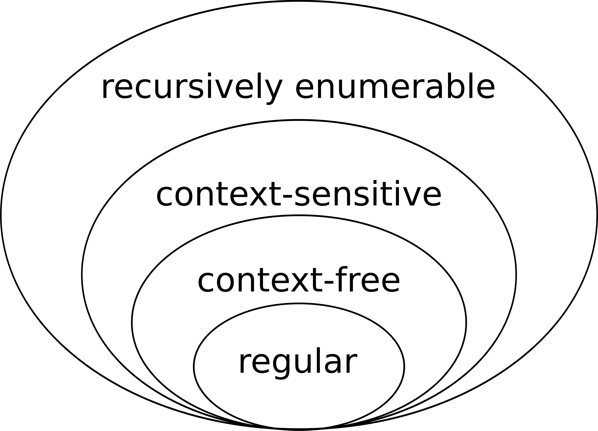
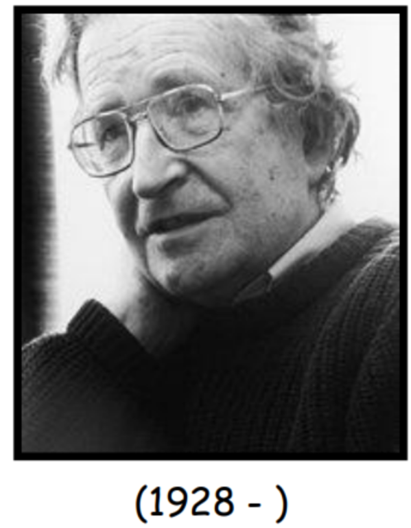

<!--
Copyright (c) 2026 Angela Villota, and collaborators from the CyED block
Licensed under the PolyForm Noncommercial License 1.0.0.
Commercial use is prohibited without prior written authorization.
-->

# Regular languages and regular expressions — summary and examples

This page consolidates the lecture-slide walkthrough on regular languages and
regular expressions into a single reference. It follows the same worked
examples used in class, with every intermediate question and its answer shown
together instead of split across slides.

## 1. Where regular languages sit in the Chomsky hierarchy

| Type | Languages | Machine type | Grammar rules |
|---|---|---|---|
| 0 | Recursively enumerable | Turing machine | Unrestricted |
| 1 | Context-sensitive | Linear bounded automaton | $\alpha\rightarrow\beta,\ \lvert\alpha\rvert\le\lvert\beta\rvert$ |
| 2 | Context-free | Pushdown automaton | $A\rightarrow\gamma$ |
| 3 | Regular | Finite automaton | $A\rightarrow aB$, $A\rightarrow a$ |

Regular languages are the smallest, most restricted class. Every regular
language is context-free, every context-free language is context-sensitive,
and every context-sensitive language is recursively enumerable — but not the
other way around.

*Source: [Wikimedia Commons — Chomsky-hierarchy.svg](https://upload.wikimedia.org/wikipedia/commons/9/9a/Chomsky-hierarchy.svg).*

*Source: [GeeksforGeeks — Chomsky hierarchy in theory of computation](https://www.geeksforgeeks.org/theory-of-computation/chomsky-hierarchy-in-theory-of-computation/).*

:::{note} Noam Chomsky
- Defined context-free grammars.
- Creator of the Chomsky hierarchy (1956).
- Defined Chomsky Normal Form (1979).
:::

## 2. Definition of a regular language

Given an alphabet $\Sigma$, the regular languages over $\Sigma$ are defined
recursively:

- $\emptyset$ is a regular language.
- $\{\varepsilon\}$ is a regular language.
- For every symbol $a\in\Sigma$, $\{a\}$ is a regular language.
- If $A$ and $B$ are regular languages, then $A\cup B$, $A\cdot B$, and $A^*$
  are regular languages.
- No other language is regular.

## 3. Checking regularity: worked examples

Given $\Sigma=\{a,b\}$, the following statements are correct:

- $\emptyset$ and $\{\varepsilon\}$ are regular languages.
- $\{a\}$ and $\{b\}$ are regular languages.
- $\{a,b\}$ is regular because it is the union of $\{a\}$ and $\{b\}$.
- $\{ab\}$ is regular because it is the concatenation of $\{a\}$ and $\{b\}$.
- $\{a,ab,b\}$ is regular because it is the union of two regular languages.
- $\{a^n\mid n\geq0\}$ is regular.
- $\{a^mb^n\mid m\geq0\land n\geq0\}$ is regular.
- $\{(ab)^n\mid n\geq0\}$ is regular.

### Exercise: classify each language

Given $\Sigma=\{a,b,c\}$, indicate whether each language is regular:

1. $\{a\}^*$
2. $\{a\}^*\cup\{b\}^*$
3. $\{a\}^*\cdot\{b\}^*$
4. $\{a,bc\}^*$
5. $\{a\}\cdot\{b,c,ab\}$
6. $\{a^nb^n\mid n\geq0\}$
7. $\{a^lb^mc^n\mid l\geq0,m\geq0,n\geq0\}$
8. $\{a^nb^{2n}\mid n\geq0\}$

:::{dropdown} Answers
1–5 and 7 are regular: each is built from finite base languages using only
union, concatenation, and Kleene star.

6. $\{a^nb^n\mid n\geq0\}$ is **not regular** — no finite automaton can count
   an unbounded number of $a$'s and later check that the same number of $b$'s
   follows.
8. $\{a^nb^{2n}\mid n\geq0\}$ is **not regular**, for the same counting
   reason.
:::

### Why $\{a^nb^n\mid n\geq0\}$ is not regular

$$
\{a^n\mid n\geq0\}=\{\varepsilon,a,aa,aaa,\ldots\},
\qquad
\{b^n\mid n\geq0\}=\{\varepsilon,b,bb,bbb,\ldots\}.
$$

The string $aab$ belongs to
$\{a^n\mid n\geq0\}\cdot\{b^n\mid n\geq0\}$ (take $n=2$ on the left and $n=1$
on the right), yet $aab$ does not satisfy the pattern $a^nb^n$ for any single
$n$. A concatenation of two regular (counting-free) languages cannot enforce
that both counters agree, which is exactly what $a^nb^n$ requires.

## 4. Positive closure from Kleene closure

Develop $L=\{abc,ab,a\}^+$:

$$
L=\{abc,ab,a,\ abcabc,\ abcab,\ abca,\ \ldots\}.
$$

Compare it with $\{abc,ab,a\}^*$:

$$
\{abc,ab,a\}^*=\{\varepsilon,abc,ab,a,abcabc,abcab,abca,\ldots\},
$$

$$
\{abc,ab,a\}^+=\{abc,ab,a,abcabc,abcab,abca,\ldots\}.
$$

The only difference is $\varepsilon$. In general,

$$
\{abc,ab,a\}^+=\{abc,ab,a\}^*\cdot\{abc,ab,a\},
\qquad\text{i.e.}\qquad
A^+=A^*\cdot A.
$$

## 5. More regularity checks

Indicate whether each language is regular:

| Language | Regular? |
|---|---|
| $\{ab^na\mid n\geq0\}$ | Yes — $ab^*a$ |
| $\{a^nb^mc^{n+m}\mid n,m\geq0\}$ | No — the exponent on $c$ must track two independent counters |
| $\{a^nb^mc^n\mid n,m\geq0\}$ | No — the first and last counters must match across an unbounded gap |
| $\{(abc)^n\mid n\geq0\}$ | Yes — $(abc)^*$ |
| $\{(abc)^n\cdot(cba)^n\mid n\geq0\}$ | No — the two counters must agree |
| $\{(ab)^n\cdot(cd)^m\mid m,n\geq0\}$ | Yes — $(ab)^*(cd)^*$, the counters are independent |
| $\{wcw\mid w\in\{a,b\}^*\}$ | No — the automaton would need to remember all of $w$ |
| $\{w\in\{a,b\}^*\mid \lvert w\rvert=2k,\ k\geq0\}$ | Yes — even-length strings, $((a\cup b)(a\cup b))^*$ |
| $\{aa,ab,ba,bb\}^*$ | Yes — union and Kleene star of a finite base language |

A useful rule of thumb: a language is typically **not** regular when accepting
a string requires comparing two unbounded counts, or remembering an
unbounded, unstructured piece of the input to check later.

## 6. Developing regular languages from their structure

| Language | Expansion |
|---|---|
| $\{a\}^*$ | $\{\varepsilon,a,aa,aaa,aaaa,\ldots\}$ |
| $\{a\}^*\cup\{b\}^*$ | $\{\varepsilon,a,b,aa,bb,aaa,bbb,\ldots\}$ |
| $\{a\}^*\cdot\{b\}^*$ | $\{\varepsilon,a,aa,\ldots,ab,aab,\ldots,b,bb,bbb,\ldots\}$ |
| $\{a,bc\}^*$ | $\{\varepsilon,a,bc,aa,abc,bca,bcbca,aaa,\ldots\}$ |
| $\{abc,ab,a\}^+$ | $\{abc,ab,a,abcabc,abcab,abca,\ldots\}$ |
| $\{a\}\cdot\{b,c,ab\}$ | $\{ab,ac,aab\}$ |
| $\{(ab)^i\mid i\geq0\}$ | $\{\varepsilon,ab,abab,ababab,\ldots\}$ |
| $\{a^nb^m\mid n\geq0,m\geq0\}$ | $\{\varepsilon,a,b,ab,aab,abb,aaab,\ldots\}$ |
| $\{a^lb^mc^n\mid l\geq0,m\geq0,n\geq0\}$ | $\{\varepsilon,a,b,c,ab,bc,abc,aa,aab,aac,\ldots\}$ |

### Membership checks along the way

- Is $ab\in\{a\}^*\cup\{b\}^*$? **No** — the union keeps the symbols
  separate; $ab$ mixes them.
- Is $bbb\in\{a\}^*\cdot\{b\}^*$? **Yes.** Is $baa\in\{a\}^*\cdot\{b\}^*$?
  **No** — every $a$ must come before every $b$.
- Is $bcbca\in\{a,bc\}^*$? **Yes** (parsed as $bc\cdot bc\cdot a$). Is
  $baaa\in\{a,bc\}^*$? **No** — a lone $b$ is not one of the base strings.

## 7. Membership in a union of closures

Given $L=\{a,bc\}^*\cup\{ad,d\}^*$:

| String | In $L$? |
|---|---|
| $bcabc$ | Yes |
| $aabcad$ | No |
| $adbc$ | No |
| $adad$ | Yes |
| $adddd$ | Yes |

Each candidate string must be checked against *both* halves of the union: it
belongs to $L$ as soon as it can be fully decomposed using the base strings
of either $\{a,bc\}$ or $\{ad,d\}$ — but not by mixing base strings from the
two halves.

## 8. Interpreting a regular language in words

**Interpret $L=\{a\}^*\cup\{b\}^*$.**

:::{dropdown} Interpretation
Strings that have only $a$'s or only $b$'s. These symbols never appear mixed.
:::

**Interpret $L=\{a\}^*\cdot\{b\}^*$.**

:::{dropdown} Interpretation
Strings that have zero or more $a$'s followed by zero or more $b$'s.
:::

## 9. From natural language to language structure

Given $\Sigma=\{a,b\}$:

**Language $A$: all words that have exactly one $a$.**

:::{dropdown} Language structure
$$
A=\{b\}^*\cdot\{a\}\cdot\{b\}^*.
$$
:::

**Language $B$: all words that begin with $b$.**

:::{dropdown} Language structure
$$
B=\{b\}\cdot(\{a\}\cup\{b\})^*.
$$
:::

**Language $C$: all words that contain the string $ba$.**

:::{dropdown} Language structure
$$
C=(\{a\}\cup\{b\})^*\cdot\{ba\}\cdot(\{a\}\cup\{b\})^*.
$$
:::

## 10. Regular expressions

A **regular expression** is a simplified way of representing a regular
language.

| Regular language | Regular expression |
|---|---|
| $\{ab\}$ | $ab$ |
| $\{a\}^*$ | $a^*$ |
| $\{a\}^+$ | $a^+$ |
| $\{a\}\cup\{b\}$ | $a\cup b$ |

Some regular expressions:

- $b^*$
- $b(a\cup b)^*$
- $(a\cup b)^*ba(a\cup b)^*$

## 11. From natural language to a regular expression

Over $\Sigma=\{a,b\}$, give the regular expression for each description.

**All words that begin with $b$ and end with $a$.**

:::{dropdown} Regular expression
$$
b(a\cup b)^*a
$$
:::

**All words that have exactly two $a$'s.**

:::{dropdown} Regular expression
$$
b^*ab^*ab^*
$$
:::

**All words that have an even number of $a$'s.**

:::{dropdown} Regular expression
$$
(b^*ab^*ab^*)^*
$$
:::

**All words that have even length.**

:::{dropdown} Regular expression
$$
(aa\cup ab\cup ba\cup bb)^*
$$
:::

**All words that have odd length.**

:::{dropdown} Regular expression
$$
(aa\cup ab\cup ba\cup bb)^*(a\cup b)
$$
:::

**All words that have at least one $b$.**

:::{dropdown} Regular expression
$$
(a\cup b)^*b(a\cup b)^*
$$
:::

**All words where the second-to-last symbol is an $a$.**

:::{dropdown} Regular expression
$$
(a\cup b)^*a(a\cup b)
$$
:::

**All words where the third-to-last symbol is an $a$.**

:::{dropdown} Regular expression
$$
(a\cup b)^*a(a\cup b)(a\cup b)
$$
:::

### Exercises for the reader

Over $\Sigma=\{a,b\}$, give a regular expression for each language:

1. All strings that begin with $aa$ and end with $bb$.
2. All strings that have exactly three $b$'s.
3. All strings that begin and end with different symbols.

:::{dropdown} Answers
1. $aa(a\cup b)^*bb$
2. $a^*ba^*ba^*ba^*$
3. $a(a\cup b)^*b\cup b(a\cup b)^*a$
:::

## 12. Algebraic identities for regular expressions

These identities let you rewrite a regular expression without changing the
language it denotes.

1. $r\cup s=s\cup r$
2. $r\cup\emptyset=r=\emptyset\cup r$
3. $r\cup r=r$
4. $(r\cup s)\cup t=r\cup(s\cup t)$
5. $r\cdot\varepsilon=\varepsilon\cdot r=r$
6. $r\cdot\emptyset=\emptyset\cdot r=\emptyset$
7. $(rs)t=r(st)$
8. $r(s\cup t)=rs\cup rt$
9. $r^*=(r^*)^*=r^*r^*=(\varepsilon\cup r)^*$
10. $(r\cup s)^*=(r^*\cup s^*)^*=(r^*s^*)^*$
11. $r(sr)^*=(rs)^*r$
12. $(r^*s)^*=\varepsilon\cup(r\cup s)^*s$
13. $(rs^*)^*=\varepsilon\cup r(r\cup s)^*$
14. $s(r\cup\varepsilon)^*(r\cup\varepsilon)\cup s=sr^*$
15. $rr^*=r^*r$
16. $(r\cup\varepsilon)^*=r^*$

## References

Kozen, D. C. (2007). *Automata and computability*. Springer Science &
Business Media. Lectures 3–4.

---

Continue with the [session narrative](index.md), the
[Session 2 practice set](exercises.md), or the
[executable Python notebook](regex-python.ipynb).
