<!--
Copyright (c) 2026 Angela Villota, and collaborators from the CyED block
Licensed under the PolyForm Noncommercial License 1.0.0.
Commercial use is prohibited without prior written authorization.
-->

# Finite state machines (automata) — summary and examples

This page consolidates the lecture-slide walkthrough on finite automata,
including the transition-diagram images used in class. It follows the same
worked examples used in the slides, with every intermediate question and its
answer shown together. The slides use $T$ for the set of accepting states;
[Session 3](../S3/index.md) uses $F$ for the same idea — both notations refer
to the same component of the automaton.

## 1. Finite automata and regular languages

| Type | Languages | Machine type | Grammar rules |
|---|---|---|---|
| 0 | Recursively enumerable | Turing machine | Unrestricted |
| 1 | Context-sensitive | Linear bounded automaton | $\alpha\rightarrow\beta,\ \lvert\alpha\rvert\le\lvert\beta\rvert$ |
| 2 | Context-free | Pushdown automaton | $A\rightarrow\gamma$ |
| 3 | Regular | Finite automaton | $A\rightarrow aB$, $A\rightarrow a$ |

A **finite automaton** can be constructed for each of these languages:

- $\{a\}^*$
- $\{a\}^*\cup\{b\}^*$
- $\{a\}^*\cdot\{b\}^*$
- $\{a,bc\}^*$
- $\{a\}\cdot\{b,c,ab\}$
- $\{(ab)^n\mid n\geq0\}$
- $\{a^nb^m\mid n\geq0,m\geq0\}$
- $\{a^lb^mc^n\mid l\geq0,m\geq0,n\geq0\}$

**No** finite automaton can be constructed for any of these non-regular
languages:

- $\{a^nb^n\mid n\geq0\}$
- $\{a^nb^{2n}\mid n\geq0\}$
- $\{wcw\mid w\in\{a,b\}^*\}$

## 2. What a finite automaton is

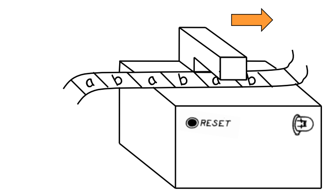

A finite automaton can be designed to **accept**, for example, the language
$\{ab\}^*=\{\varepsilon,ab,abab,ababab,\ldots\}$.

Consider the regular language $L$ represented by $c^*(a\cup bc^*)^*$. Does
$w_1=abc^5ab$ belong to $L$? Does $w_2=cabac^3bc$ belong to $L$? To determine
whether a string $w$ is generated by a language $L$, a **finite automaton**
can be built for $L$ and used to test $w$.

A finite automaton can be pictured as:

- a black box that accepts tape data as input;
- a light bulb as output — when the input is accepted, it lights up;
- a reset button; and
- internal **states** that summarize everything the machine remembers about
  the input read so far.

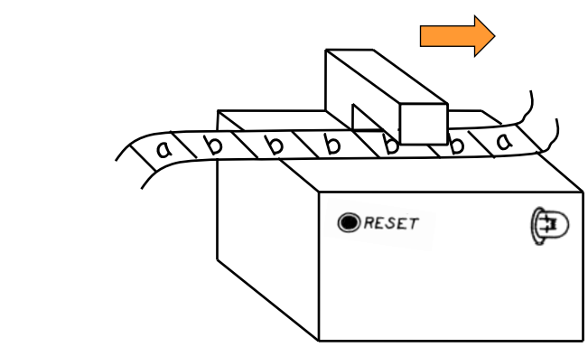

The automaton's head can only **read** (it cannot write) and always moves to
the **right**.

## 3. Transition diagrams

Finite automata are represented by a directed graph called the **transition
diagram**:

- Nodes are **states** — one is the initial state, some are accepting states.
- Edges are **transitions**, each labeled with an input symbol.

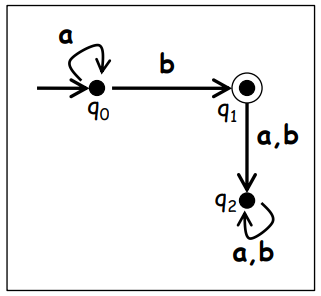

Each **step** depends only on the pair (symbol read, current state).

### Tracing the string $aab$

Starting at $q_0$, follow the computation step by step:

1. $(q_0,a)\Rightarrow q_0$ — read the first $a$, stay at $q_0$.

   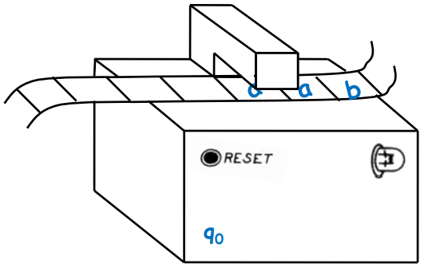

2. $(q_0,a)\Rightarrow q_0$ — read the second $a$, stay at $q_0$.

   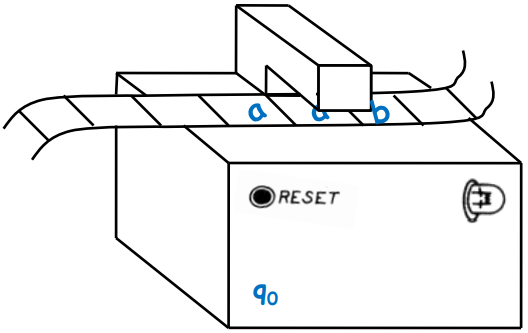

3. Head still at $q_0$, one symbol left to read.

   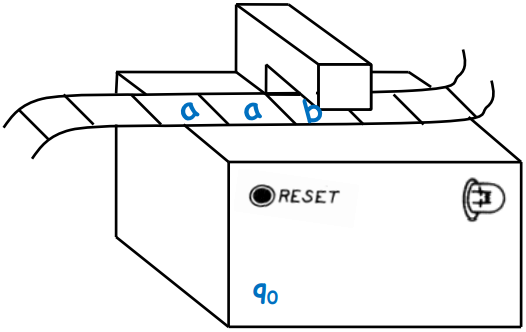

4. $(q_0,b)\Rightarrow q_1$ — read $b$, move to $q_1$.

   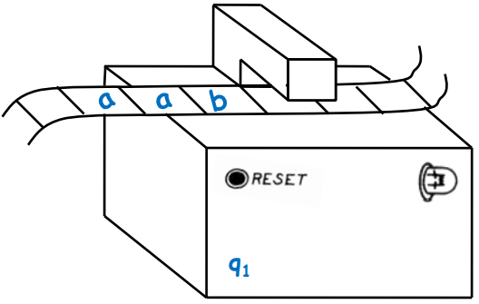

Since every symbol on the tape has been consumed and $q_1$ is an accepting
state, the automaton recognizes **$aab$**.

### More strings on the same automaton

- Is $aaa$ accepted? Trace it below — the automaton never leaves $q_0$, and
  $q_0$ is not an accepting state for this machine, so $aaa$ is **rejected**.

  

- Is $aba$ accepted? The head ends outside the accepting state, so $aba$ is
  **rejected**.

  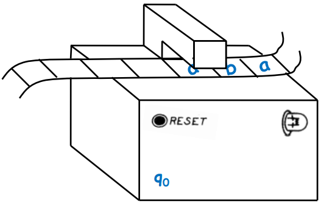

- Is the empty string $\varepsilon$ accepted? With no symbols read, the
  automaton stays in $q_0$, which is not accepting, so $\varepsilon$ is
  **rejected**.

  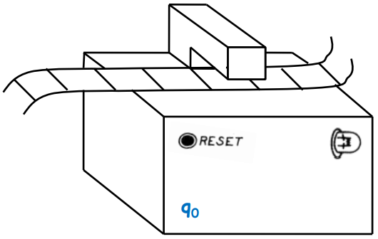

A regular expression for this automaton is $a^*b$: it accepts strings that
belong to that language.

## 4. Reading a diagram: deriving the accepted language

**From the automaton below, are $\varepsilon$, $ab$, $bab$, $ba^4b$, and
$ab^3a$ accepted?**

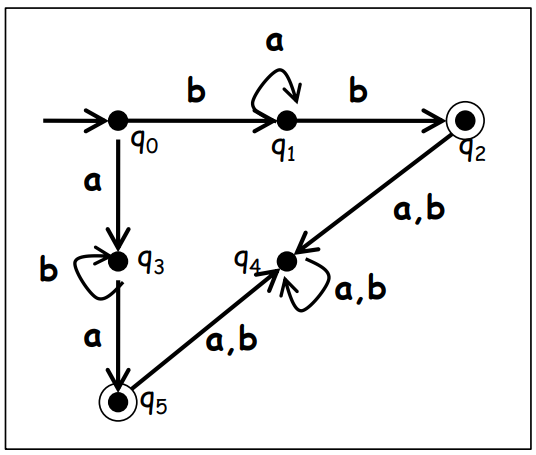

:::{dropdown} Regular expression for this automaton
$$
(ab^*a)\cup(ba^*b)
$$

Only strings that start and end with the *same* symbol, with any run of the
*other* symbol in between, are accepted. So $\varepsilon$ and $bab$ are
rejected (wrong symbol pattern or too short to close the loop the same way),
while $ba^4b$ is accepted; check $ab$ and $ab^3a$ against the same pattern.
:::

**Indicate a regular expression for the automaton below.**

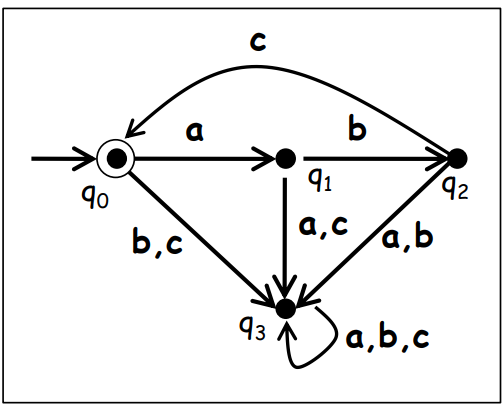

:::{dropdown} Regular expression
$$
(abc)^*
$$

From the automaton, $\varepsilon$, $abc$, and $(abc)^2$ are accepted;
$aabc$, $aba$, and $abca$ are not, because the cycle only closes after a
complete $abc$.
:::

**Indicate a regular expression for the automaton below.**

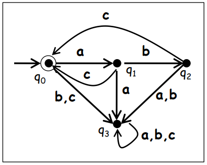

:::{dropdown} Regular expression
$$
(abc\cup ac)^*
$$

Accepted: $\varepsilon$, $abc$, $(abc)^2$, $(abc)^2(ac)^3$. Rejected:
$abcac$ is fine (it is $abc$ followed by $ac$) — check it against the
expression; $(ac)^{10}$ and $a^2b^2c^2$ are not accepted because the
automaton never allows two consecutive $a$'s or $b$'s outside the $abc$ and
$ac$ blocks.
:::

## 5. Designing automata from a regular expression

**Design a finite automaton that accepts $a^+b$.**

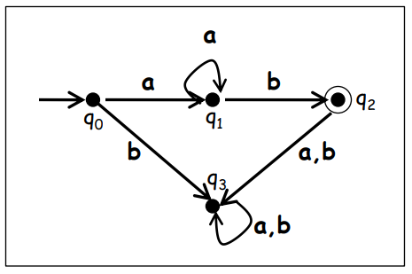

**Regular expression:** $a^+b$. **Language:** $\{ab,aab,aaab,\ldots\}$.

**Design a finite automaton that accepts $a(a\cup b)^*c$.**

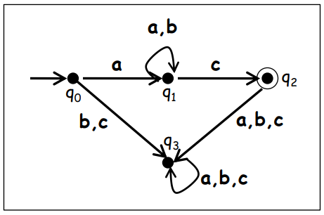

**Regular expression:** $a(a\cup b)^*c$. **Language:**
$\{ac,aac,abc,aabc,\ldots\}$.

**Design a finite automaton that accepts $(ab)^*$.**

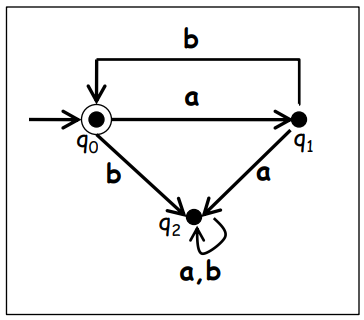

**Regular expression:** $(ab)^*$. **Language:**
$\{\varepsilon,ab,abab,ababab,\ldots\}$.

:::{important} Kleene's theorem
A language is regular if and only if it is accepted by some finite
automaton.
:::

## 6. Deterministic vs. non-deterministic automata

Finite automata are divided into deterministic finite automata (**DFA**) and
non-deterministic finite automata (**NFA**).

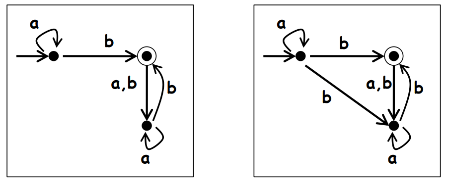

- Given a state $q$ and a symbol $x$, there is a **single** transition edge —
  this is a **DFA**.
- Given a state $q$ and a symbol $x$, there can be **multiple** possible
  transitions (or none) — this is an **NFA**.

## 7. Deterministic finite automata (DFA)

A DFA is a collection of five elements:

- an alphabet $\Sigma$;
- a finite collection of states $Q$;
- an initial state $q_0$;
- a finite collection of accepting states $T$; and
- a function $\delta:Q\times\Sigma\Rightarrow Q$ that determines the
  **unique** next state for the pair $(q_i,\sigma)$, given the current state
  $q_i$ and input $\sigma$.

$\delta$ must be a **function** for determinism to exist.

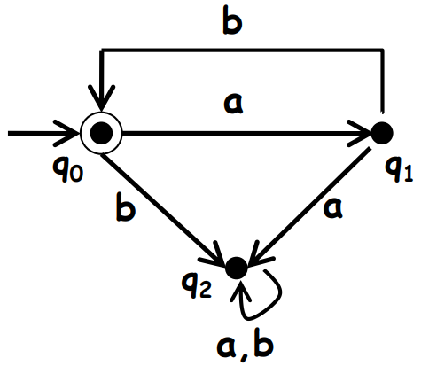

### Worked examples: transition table and diagram together

**Example 1.** $\Sigma=\{a,b\}$, $Q=\{q_0,q_1,q_2\}$, initial state $q_0$,
$T=\{q_0\}$.

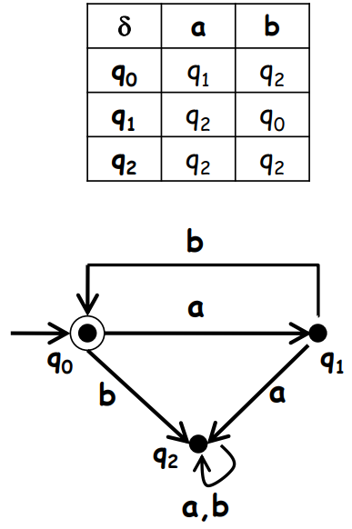

**Example 2.** $\Sigma=\{a,b\}$, $Q=\{q_0,q_1,q_2\}$, initial state $q_0$,
$T=\{q_0,q_2\}$.

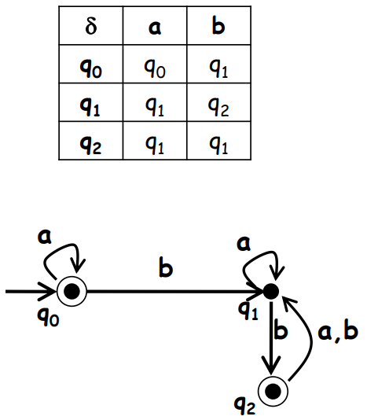

**Example 3 — indicate the accepted language.** $\Sigma=\{a,b\}$,
$Q=\{q_0,q_1\}$, initial state $q_0$, $T=\{q_0\}$.

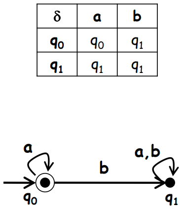

:::{dropdown} Accepted language
The language accepted by the automaton is $a^*$.
:::

**Example 4 — indicate the accepted language.** $\Sigma=\{a,b\}$,
$Q=\{q_0,q_1,q_2\}$, initial state $q_0$, $T=\{q_1\}$.

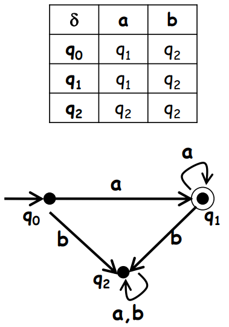

:::{dropdown} Accepted language
The language accepted by the automaton is $a^+$.
:::

**Example 5 — indicate the accepted language.** $\Sigma=\{a,b\}$,
$Q=\{q_0,q_1,q_2,q_3\}$, initial state $q_0$, $T=\{q_2\}$.

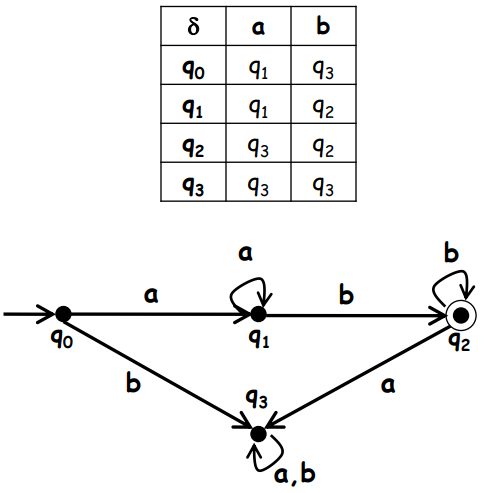

:::{dropdown} Accepted language
The language accepted by the automaton is $a^+b^+$.
:::

### Design exercises

**Design a DFA over $\Sigma=\{a,b\}$ that recognizes $b^*a^+$.**

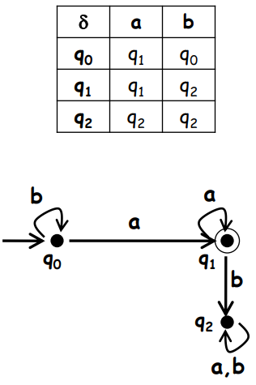

$Q=\{q_0,q_1,q_2\}$, initial state $q_0$, $T=\{q_1\}$.

**Design a DFA over $\Sigma=\{a,b\}$ that recognizes all words with an even
number of $a$'s** (zero $a$'s counts as even, so it is accepted).

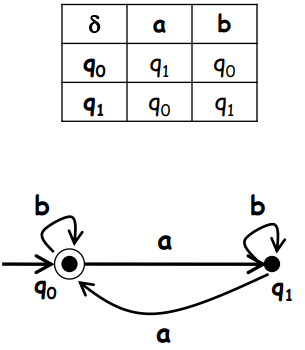

$Q=\{q_0,q_1\}$, initial state $q_0$, $T=\{q_0\}$.

**Design a DFA over $\Sigma=\{a,b\}$ that recognizes all words with at least
one $a$.**

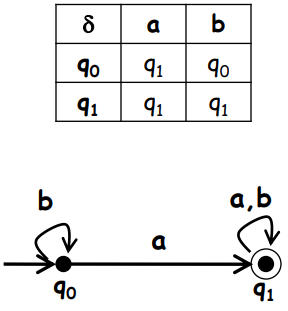

$Q=\{q_0,q_1\}$, initial state $q_0$, $T=\{q_1\}$. This automaton accepts
$b^*a(a\cup b)^*$.

**Design a DFA over $\Sigma=\{a,b\}$ that recognizes $a^+b^+$.**

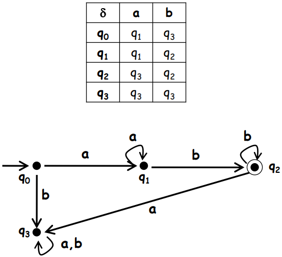

$Q=\{q_0,q_1,q_2,q_3\}$, initial state $q_0$, $T=\{q_2\}$.

**Design a DFA over $\Sigma=\{a,b\}$ that recognizes all strings of even
length** (including the empty string).

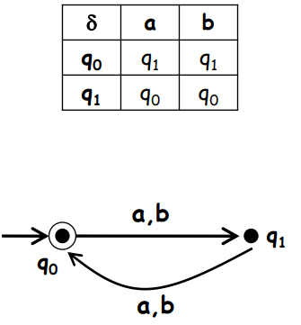

$Q=\{q_0,q_1\}$, initial state $q_0$, $T=\{q_0\}$. This automaton accepts
$((a\cup b)(a\cup b))^*$, equivalently $(aa\cup ab\cup ba\cup bb)^*$.

As an exercise, design a DFA over $\Sigma=\{a,b\}$ that recognizes all
strings that begin and end with the same symbol.

## 8. Non-deterministic finite automata (NFA)

If zero, two, or more transitions are allowed from some state using the same
input symbol, the finite automaton is **non-deterministic**.

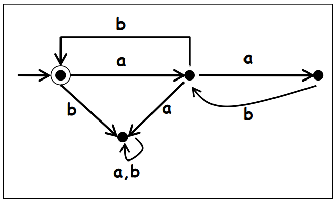

NFAs are used because they can be simpler than an equivalent DFA.

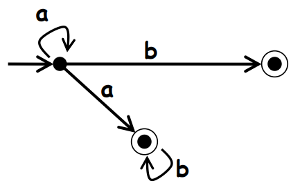

This NFA accepts $a^*b\cup a^+b^*$.

**Does the automaton below accept or reject the string $aabb$?**

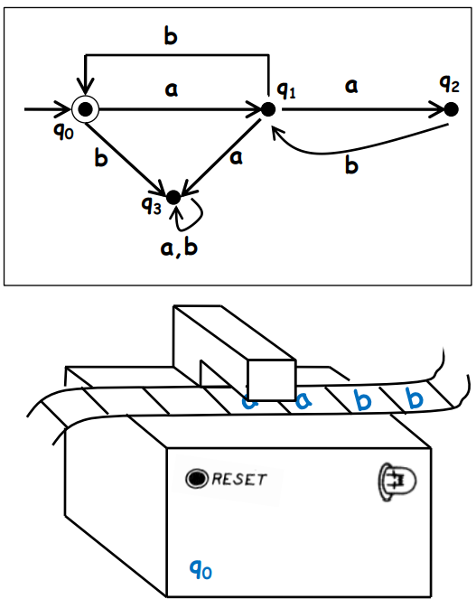

In an NFA, it can be assumed that if there exists *some* path through the
transition diagram that ends in an accepting state, the automaton finds it —
acceptance means "there exists an accepting run," not "every run accepts."

### Formal definition

An NFA is a collection of five elements:

- an alphabet $\Sigma$;
- a finite collection of states $Q$;
- an initial state $q_0$;
- a finite collection of accepting states $T$; and
- a relation $\Delta$ over $(Q\times\Sigma)\Rightarrow2^Q$ called the
  **transition relation**, where $2^Q$ is the power set of $Q$ (every subset
  of $Q$).

**Example.** $\Sigma=\{a,b\}$, $Q=\{q_0,q_1,q_2,q_3,q_4\}$, initial state
$q_0$, $T=\{q_2,q_3,q_4\}$, $\Delta:Q\times\Sigma\Rightarrow2^Q$.

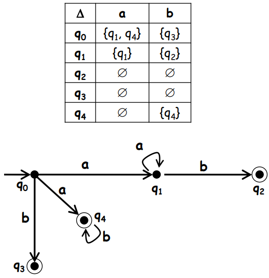

**Does the string $baa$ get accepted or rejected?** If the string is not
fully consumed along any path that reaches an accepting state, it is
rejected. Trace every branch before concluding.

**Example.** $\Sigma=\{a,b\}$, $Q=\{q_0,q_1,q_2\}$, initial state $q_0$,
$T=\{q_0\}$.

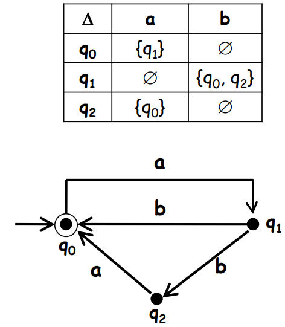

This NFA accepts $(ab\cup aba)^*$.

### Design exercises

**Design the NFA below and indicate the accepted language.** $\Sigma=\{a,b\}$,
$Q=\{q_0,q_1,q_2\}$, initial state $q_0$, $T=\{q_2\}$.

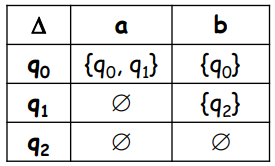

**Design an NFA over $\Sigma=\{a,b\}$ that recognizes all strings ending in
$ab$, given by $(a\cup b)^*ab$.**

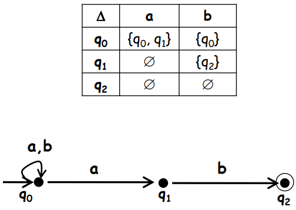

**Design the NFA below and indicate the accepted language.** $\Sigma=\{a,b\}$,
$Q=\{q_0,q_1,q_2,q_3,q_4\}$, initial state $q_0$, $T=\{q_2,q_4\}$.

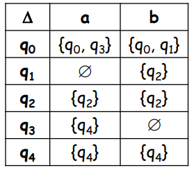

:::{dropdown} Accepted language
$$
(a\cup b)^*(aa\cup bb)(a\cup b)^*
$$
:::

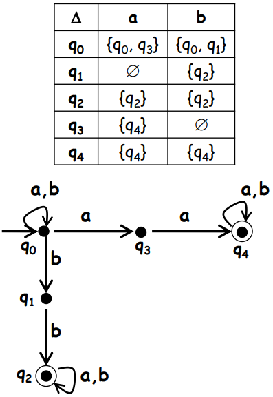

**Design an NFA over $\Sigma=\{a,b\}$ that recognizes all strings ending in
$b$, given by $(a\cup b)^*b$.**

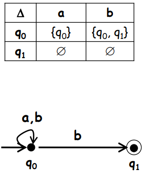

**Design an NFA over $\Sigma=\{a,b\}$ that recognizes all strings with at
least two consecutive $a$'s, given by $(a\cup b)^*aa(a\cup b)^*$.**

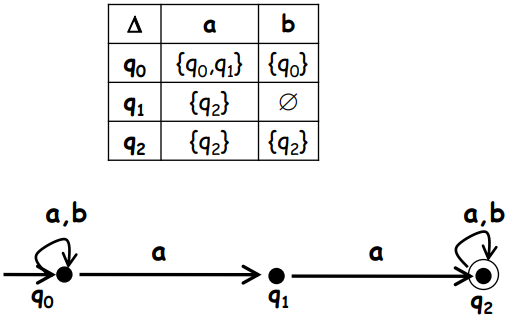

## 9. Equivalence between DFA and NFA

Consider the NFA that recognizes the language of words over $\Sigma=\{a,b\}$
that end in $b$:

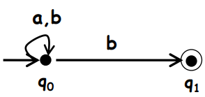

A DFA that recognizes the same language:

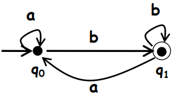

:::{important} Equivalence between DFA and NFA
Every NFA $M'$ has an equivalent DFA $M$ such that $L(M')=L(M)$.
:::

## References

Kozen, D. C. (2007). *Automata and computability*. Springer Science &
Business Media. Lectures 3–5.

---

Continue with [Session 3 — deterministic and nondeterministic finite
automata](../S3/index.md) and its [practice set](../S3/exercises.md) for the
formal definitions, $\delta^*$, and $\varepsilon$-closures.
