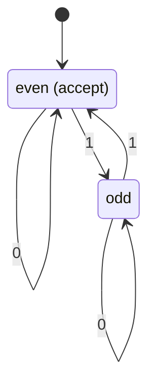

<!--
Copyright (c) 2026 Angela Villota, and collaborators from the CyED block
Licensed under the PolyForm Noncommercial License 1.0.0.
Commercial use is prohibited without prior written authorization.
-->

# Deterministic and nondeterministic finite automata

A regular expression describes a language. A **finite automaton** recognizes a
language by reading an input string from left to right while storing only a
finite amount of information in its current state.

The key question is not whether a machine “understands” the whole input. It is
whether the machine's state contains exactly the information needed to decide
acceptance after the final symbol.

## Learning objectives

After this session, you should be able to:

- identify every component of a finite automaton;
- trace a string through a transition table or diagram;
- define the language recognized by a DFA;
- explain nondeterministic acceptance precisely;
- simulate an NFA using sets of active states;
- compute an $\varepsilon$-closure; and
- explain why DFAs, NFAs, and $\varepsilon$-NFAs recognize the same class of
  languages.

## 1. Deterministic finite automata

A **deterministic finite automaton** (DFA) is a five-tuple

$$
M=(\Sigma,Q,q_0,F,\delta),
$$

where:

- $\Sigma$ is a finite input alphabet;
- $Q$ is a finite set of states;
- $q_0\in Q$ is the initial state;
- $F\subseteq Q$ is the set of accepting states; and
- $\delta:Q\times\Sigma\to Q$ is the transition function.

For every state-symbol pair, $\delta$ returns **exactly one** state. This is the
meaning of deterministic.

:::{note}
$F$ is allowed to be empty. Such a DFA rejects every string and recognizes the
empty language.
:::

### One transition step

If $\delta(q,a)=p$, then a machine in state $q$ that reads symbol $a$ moves to
state $p$. The input symbol is consumed; the automaton never moves backward.

The machine begins in $q_0$. After all symbols have been read, it accepts if
and only if the current state belongs to $F$.

### Extended transition function

The ordinary transition function consumes one symbol. Its extension
$\delta^*:Q\times\Sigma^*\to Q$ consumes a complete string:

$$
\delta^*(q,\varepsilon)=q,
$$

$$
\delta^*(q,wa)=\delta(\delta^*(q,w),a).
$$

The language recognized by $M$ is

$$
L(M)=\{w\in\Sigma^*\mid\delta^*(q_0,w)\in F\}.
$$

## 2. Worked DFA: an even number of ones

Consider binary strings with an even number of `1` symbols. The automaton only
needs to remember the parity of the count seen so far.

Its transition table is:

| State | Input `0` | Input `1` | Accepting? |
|---|---|---|---|
| $q_E$ | $q_E$ | $q_O$ | Yes |
| $q_O$ | $q_O$ | $q_E$ | No |

Trace `10110`:

$$
q_E\xrightarrow{1}q_O\xrightarrow{0}q_O
\xrightarrow{1}q_E\xrightarrow{1}q_O\xrightarrow{0}q_O.
$$

The final state is $q_O$, so the string is rejected. The empty string is
accepted because the initial state $q_E$ is accepting.

:::{tip}
Name each state by what it remembers. “Even so far” and “odd so far” are more
useful during design than arbitrary names such as $q_1$ and $q_2$.
:::

## 3. Transition diagrams and tables

A transition diagram is a directed labeled graph:

- each state is a node;
- the initial state has an incoming arrow with no source;
- accepting states are conventionally drawn with a double circle; and
- an edge $q\xrightarrow{a}p$ represents $\delta(q,a)=p$.

A transition table and diagram contain the same information. For a DFA, every
row must have exactly one destination for every symbol in $\Sigma$.

### A systematic tracing method

To avoid skipping symbols, record one state per consumed prefix:

| Consumed prefix | Current state |
|---|---|
| $\varepsilon$ | $q_0$ |
| first symbol | $\delta(q_0,a_1)$ |
| first two symbols | $\delta^*(q_0,a_1a_2)$ |
| $\cdots$ | $\cdots$ |
| complete input | accept exactly when the state is in $F$ |

## 4. Designing a DFA

A useful design process is:

1. State the property to remember after every prefix.
2. Create one state for each relevant situation.
3. Choose the situation that holds before reading input as $q_0$.
4. Mark situations satisfying the complete-string requirement as accepting.
5. Define every state-symbol transition.
6. Test the empty string, shortest valid strings, and near misses.

### Example: strings ending in `01`

The machine must remember the longest suffix of the input that is also a prefix
of `01`:

- $q_0$: no useful suffix;
- $q_1$: the current input ends in `0`;
- $q_2$: the current input ends in `01` (accept).

| State | `0` | `1` | Accepting? |
|---|---|---|---|
| $q_0$ | $q_1$ | $q_0$ | No |
| $q_1$ | $q_1$ | $q_2$ | No |
| $q_2$ | $q_1$ | $q_0$ | Yes |

Notice that the automaton does not stop when it first reaches $q_2$. A later
symbol may move it out of the accepting state.

## 5. Nondeterministic finite automata

A **nondeterministic finite automaton** (NFA) has the same first four
components but a set-valued transition function:

$$
M=(\Sigma,Q,q_0,F,\Delta),
$$

$$
\Delta:Q\times\Sigma\to\mathcal P(Q).
$$

$\mathcal P(Q)$ is the power set of $Q$. Therefore, for one state-symbol pair,
an NFA may have:

- no possible next state;
- one possible next state; or
- several possible next states.

Nondeterminism is not randomness. Conceptually, the machine follows all
possible computations. A string is accepted if **at least one complete path**
ends in an accepting state.

## 6. Simulating an NFA with active-state sets

Instead of choosing one branch, track the set of all reachable states. Extend
$\Delta$ to sets by

$$
\widehat\Delta(S,a)=\bigcup_{q\in S}\Delta(q,a).
$$

Start with $S_0=\{q_0\}$. For every input symbol $a_i$, compute

$$
S_i=\widehat\Delta(S_{i-1},a_i).
$$

After the whole string, accept exactly when

$$
S_n\cap F\neq\emptyset.
$$

If the active set becomes empty, all paths have stopped and the string is
rejected.

### Worked NFA

Suppose an NFA over $\{a,b\}$ has transitions:

| State | `a` | `b` | Accepting? |
|---|---|---|---|
| $q_0$ | $\{q_0,q_1\}$ | $\{q_0\}$ | No |
| $q_1$ | $\emptyset$ | $\{q_2\}$ | No |
| $q_2$ | $\emptyset$ | $\emptyset$ | Yes |

This NFA accepts strings ending in `ab`. Trace `aab`:

$$
\{q_0\}\xrightarrow{a}\{q_0,q_1\}
\xrightarrow{a}\{q_0,q_1\}
\xrightarrow{b}\{q_0,q_2\}.
$$

Because $q_2$ is active after the final symbol, `aab` is accepted.

## 7. DFA–NFA equivalence

Every DFA is already an NFA whose transition sets contain exactly one state.
Conversely, every NFA can be converted into an equivalent DFA through the
**subset construction**.

Each state of the constructed DFA represents a set of NFA states:

- DFA initial state: $\{q_0\}$;
- transition from set $S$ on $a$:
  $\bigcup_{q\in S}\Delta(q,a)$;
- accepting DFA states: all sets $S$ for which $S\cap F\neq\emptyset$.

An NFA with $n$ states can produce as many as $2^n$ DFA states, although only
reachable subsets need to be constructed.

## 8. $\varepsilon$-NFAs

An $\varepsilon$-NFA permits transitions that consume no input symbol:

$$
\Delta:Q\times(\Sigma\cup\{\varepsilon\})\to\mathcal P(Q).
$$

The **$\varepsilon$-closure** of a state $q$, written
$\operatorname{EClosure}(q)$, is the set containing $q$ and every state
reachable from $q$ using only zero or more $\varepsilon$-transitions.

For a set $S$,

$$
\operatorname{EClosure}(S)
=\bigcup_{q\in S}\operatorname{EClosure}(q).
$$

### Simulation algorithm

1. Start with $S=\operatorname{EClosure}(\{q_0\})$.
2. For each input symbol $a$:
   - move on $a$ from every state in $S$;
   - take the $\varepsilon$-closure of the resulting set.
3. Accept when the final active set intersects $F$.

Algorithms record visited states while computing a closure, so an
$\varepsilon$-cycle does not create an infinite implementation loop.

## 9. Why use nondeterminism?

NFAs and $\varepsilon$-NFAs are often easier to design because they can express
choices and combine smaller machines directly. For example:

- union can branch by $\varepsilon$ into either component machine;
- concatenation can connect accepting states of one machine to the start of
  another; and
- Kleene star can add $\varepsilon$-transitions for repetition and the empty
  string.

This convenience does not increase recognition power:

$$
\text{DFA}\equiv\text{NFA}\equiv\varepsilon\text{-NFA}.
$$

All three models recognize exactly the regular languages.

## 10. Comparison

| Feature | DFA | NFA | $\varepsilon$-NFA |
|---|---|---|---|
| Next states per symbol | Exactly one | Zero or more | Zero or more |
| Moves without input | No | No | Yes |
| Runtime state representation | One state | Set of states | Closure of a set |
| Acceptance | Final state is accepting | Some path accepts | Some path accepts |
| Recognition power | Regular languages | Regular languages | Regular languages |

## 11. Common mistakes

1. Accepting as soon as an accepting state is visited instead of after all input
   is consumed.
2. Treating an NFA as if it randomly chooses one branch.
3. Rejecting an NFA string because one branch fails even though another accepts.
4. Forgetting missing DFA transitions; a DFA transition function is total.
5. Forgetting $\varepsilon$-closure before the first symbol and after every
   symbol in an $\varepsilon$-NFA.
6. Marking a subset-construction state accepting only when all its members are
   accepting; one accepting member is sufficient.

## Session summary

- A DFA stores one current state and has exactly one transition for each
  state-symbol pair.
- An NFA tracks a set of possible states and accepts existentially.
- An $\varepsilon$-NFA adds moves that consume no symbol.
- Subset construction and $\varepsilon$-closure provide systematic simulation
  and conversion algorithms.
- All three machine models recognize precisely the regular languages.

Continue with the [Session 3 automata practice set](exercises.md).
